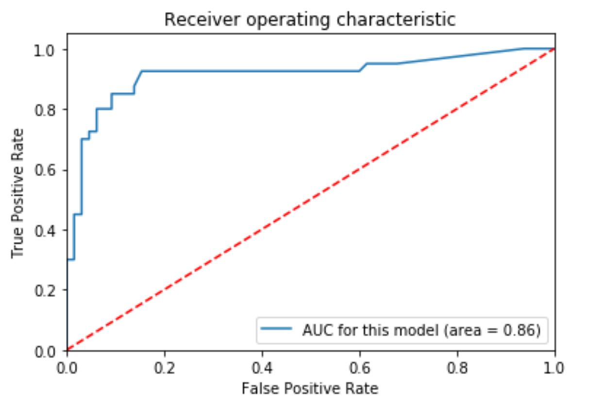
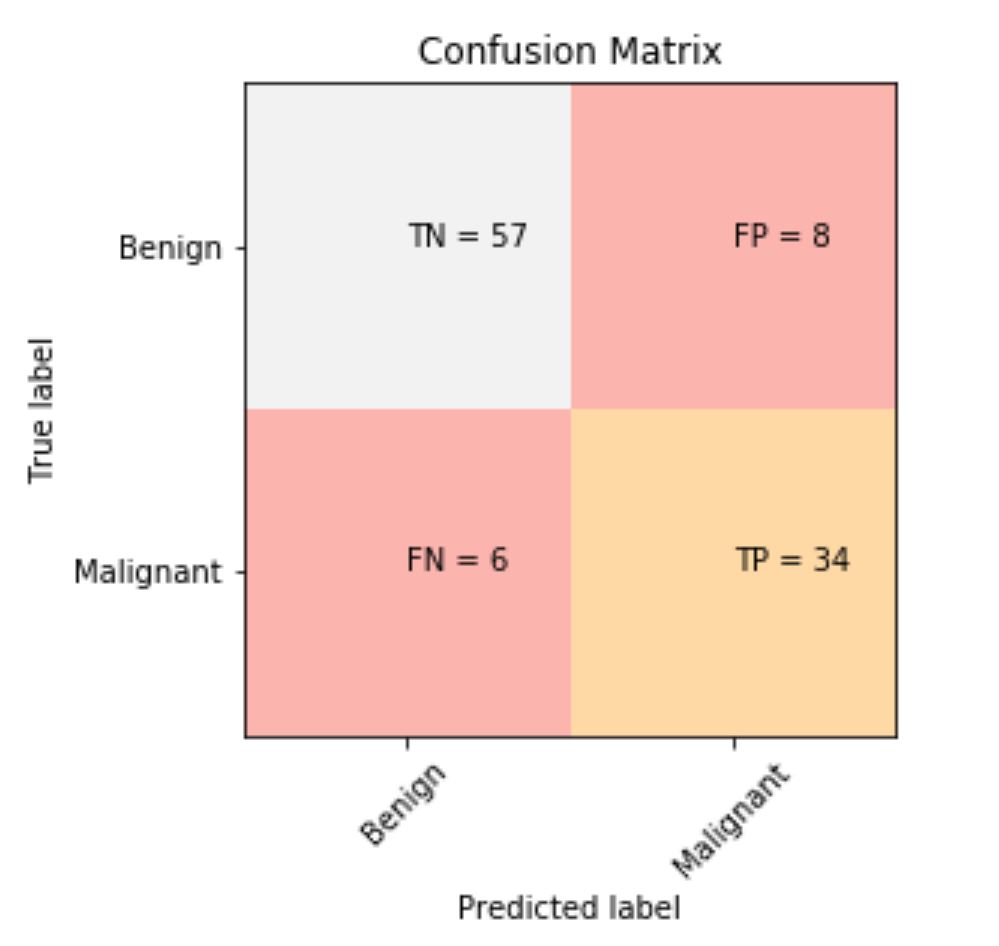
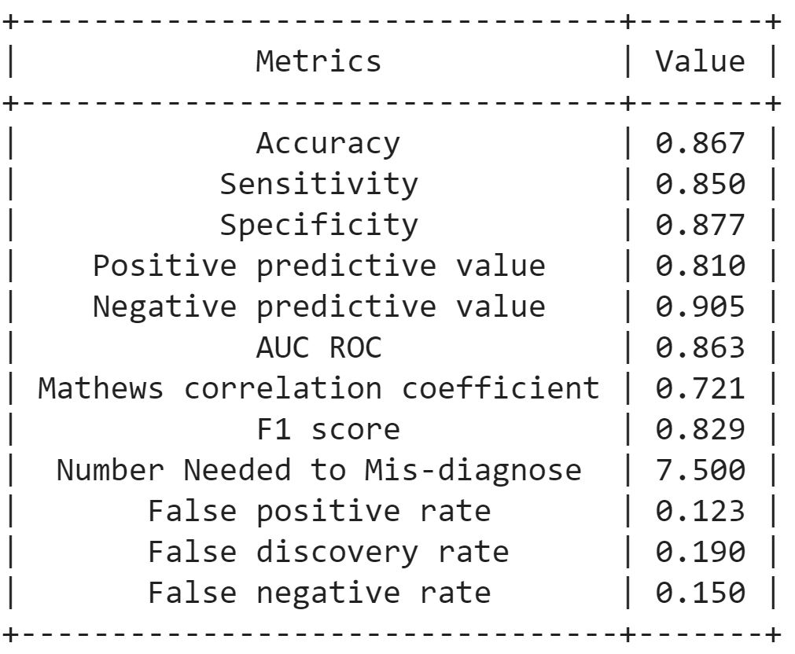

# MedML
Medical machine learning functions and scripts. 
Combined code curated from different sources for repetitive taks.

**medical_metrics.py**

<h3>1. AUC ROC Curve</h3>

  

<h3>2. Confusion Matrix</h3>

  

<h3>3. Medical Metrics</h3>

  

Calcualtes following metrics, draws confusion matrix and receiver operating curve

1.Accuracy

2.Sensitivity

3.Specificity

4.Positive predictive value

5.Negative predictive value

6.AUC ROC

7.Mathews correlation coefficient

8.F1 score

9.Number needed to mis-diagnose

10.False positive rate

11.False discovery rate

12.False negative rate

**Usage**

Download medical_metrics.py into your working directory. 
Then import it into your python file. 

`from medical_metrics import *`

You can generate the metrics and figures by passing real labels, predictions from your classifier, X_test, your model and labels for your classes

`med_metrics(y_test, preds, X_test, clf, ['Benign','Malignant'])`
